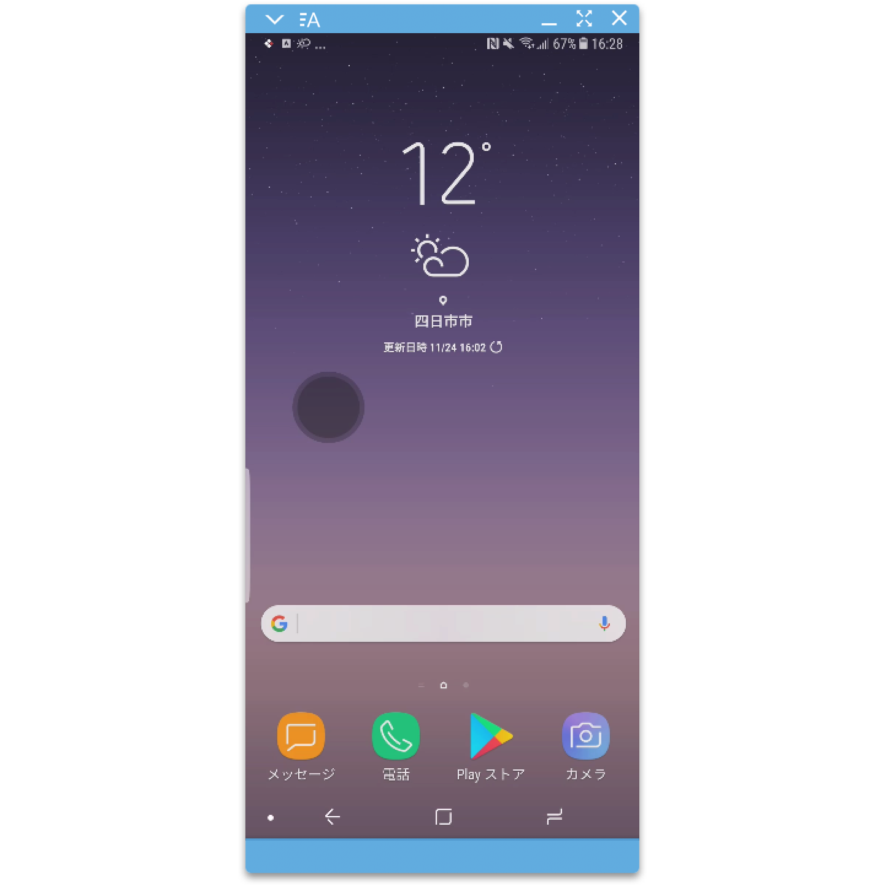
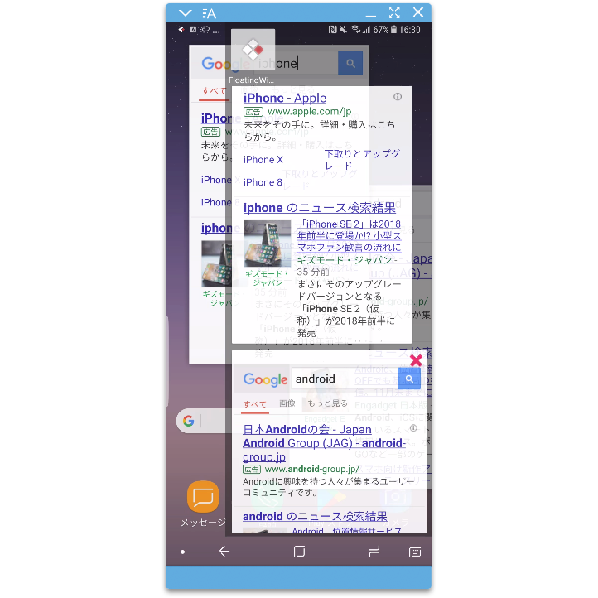
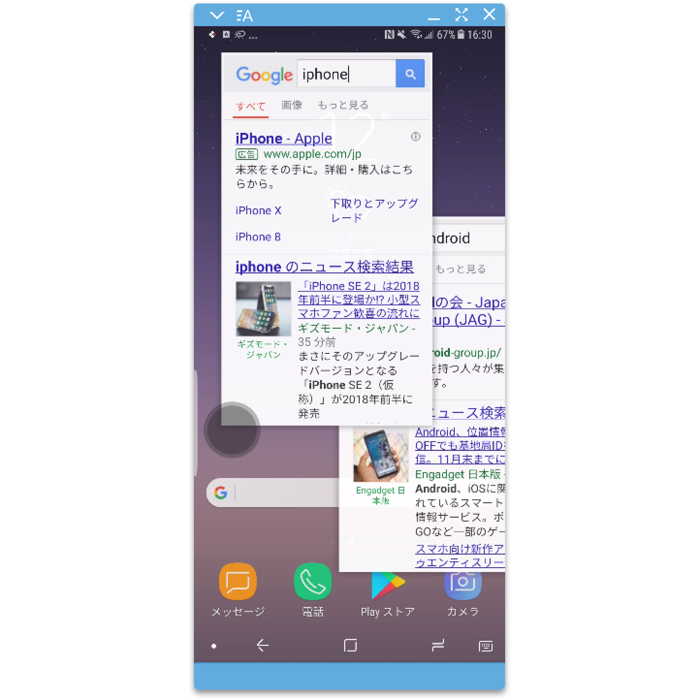
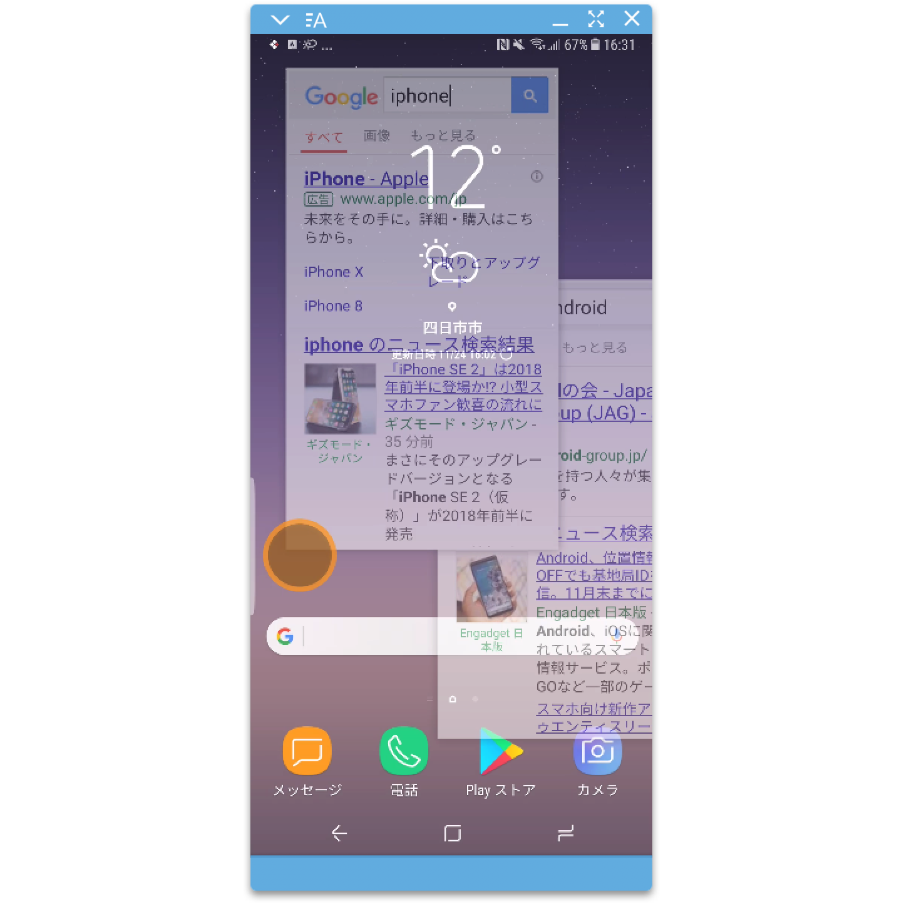
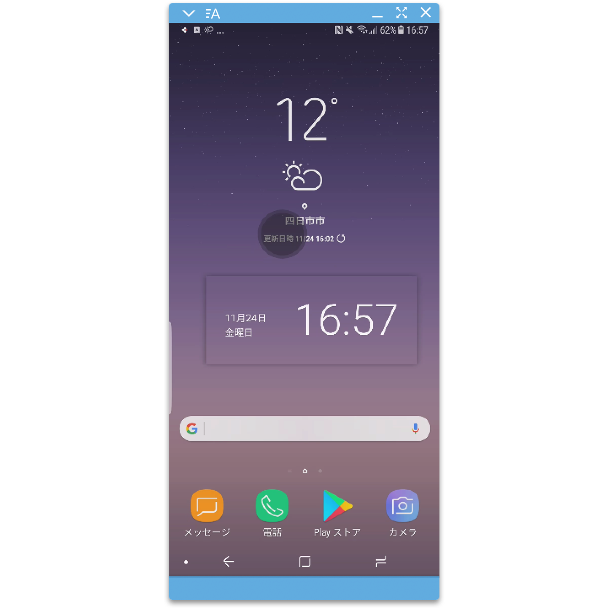

# **Floting Multiple Window Framework α2**

**現在は、テストが十分ではない実験的なリリースです。多くのバグを含む可能性があります。**

android（ルート権限不要）でフローティングウィンドウを実現し、片手操作に最適化したライブラリです。

よく似たフレームワークは、Xperiaの*Small App API*ですが、より多くの端末で動作します。

言語は*Kotlin*を採用しています。

## **Description**
容易にマルチウィンドウのアプリを作成し、追加することが出来ます。
ウィンドウの操作は片手に最適化し、ウィンドウの拡大／縮小、移動は四隅の縁に対しての操作で行います。

小窓でフレームワークに実装したアプリを表示することが出来ます。
アプリ一覧やアプリ履歴はコアに含まれるランチャーから呼び出しします。
Activityから特定のマルチウィンドウアプリを呼び出したりことが出来ます。

Coreアプリ（マルチウィンドウ機能）と、フレームワーク（アプリ追加用）にモジュールが分かれています。

## **Demo**
サンプルアプリケーションのデモ動画です

[](https://www.youtube.com/watch?v=uGvzgPG2nSM)


## **Screen Shot**
サンプルアプリケーション操作中のスクリーンショットです

1. ランチャー起動
    * 「FloatWindow」アイコンで起動します。通知を選択すると終了します。


1. アプリ一覧表示
    * ランチャーをダブルタップしてアプリ一覧表示、ロングタップでランチャー表示に戻ります。
    * アプリ一覧の上はインストール済みのアプリ一覧
    * アプリ一覧の下はアプリ履歴


1. サンプルのブラウザ起動
    * アプリ一覧のインストールされているアプリアイコンを選択すると起動。


1. 非アクティブ
    * 裏側が操作できます。
    * オレンジのランチャーを選択すると、再度アクティブになります。


1. ウィジェット
    * 「FloatWidget」を選択すると、ウィジェットも追加できます。


## **特徴**
このフレームワークの基本的な特徴になります
1. Xperia以外の端末で動作
1. マルチウィンドウで動作（同じアプリを複数開ける）
1. 片手操作への最適化（ウィンドウの拡大縮小、移動）
1. 端末の領域外に移動しても、最小化しない
1. 閉じるボタンなどの固定ボタンを廃止し、画面を広く使える（四隅のフチで操作）
1. 四隅のフチはスライドするとウィンドウの移動、長押し後にスライドするとウィンドウの拡大縮小（角は近接する2辺の拡大縮小）
1. 四隅のフチはダブルタップで最小化、上の角は最大化、下の角は最小化
1. Kotlinで実装

## **制約**
非システムアプリの為、利用しているWindowManager（`TYPE_SYSTEM_ALERT`、`TYPE_APPLICATION_OVERLAY`）に制限があり、幾つかの機能に制約があります。
1. ウィンドウが全て非アクティブになった場合、ランチャーを選択しないと復帰できない。
1. コア機能を持つアプリのインストールが必須
1. 「他のアプリの上に重ねて描画」の許可が必要
1. layoutにincludeタグが使えない

## **Requirement**
* Android 6.0 marshmallow 以上
* マルチウィンドウ機能の利用について
    - コアのインストール必須
* アプリ追加について
    - フレームワーク必須

## **Install**
現状はαリリースのため、Coreはデバッグ向けと署名なしAPKを公開し、
FrameworkライブラリはGitPagesの仮Mavenリポジトリで公開。

* Core
    * [デバッグAPK](./download/floating-window-core-debug.apk)
    * [リリース署名なしAPK](./download/floating-window-core-release-unsigned.apk)

* Framework
    
    build.gradleに下記のリポジトリとライブラリを追加してください。

    ```gradle
    repositories {
        maven { url 'http://kght6123.github.io/maven-repositories/android' }
    }
    dependencies {
        compile 'jp.kght6123.floating.window:floating-window-framework:0.0.1'
    }
    ```

## **Development environment**
* Android
    - Android Emulator 6.0〜8.0 
    - Galaxy Note8

* Develop Machine
    - macOS High Sierra 10.13.3
    - Android Studio 3.2 Canary 7

## **Application Sample**
最小限のアプリケーション実装のサンプルと解説です

1. アプリケーションのメインクラスを作成

    ```kotlin
    class FloatWindowHelloApplication : FloatWindowApplication() {
        /**
        * Ankoでウィンドウのレイアウトを定義
        */
        class HelloUi: AnkoComponent<FloatWindowHelloApplication> {
            override fun createView(ui: AnkoContext<FloatWindowHelloApplication>) = with(ui) {
                verticalLayout {
                    textView {
                        text = "Hello, Floating Window!!"
                    }
                }
            }
        }
        /**
        * Ankoで最小化時のアイコンのレイアウトを定義
        */
        class HelloMiniUi: AnkoComponent<FloatWindowHelloApplication> {
            override fun createView(ui: AnkoContext<FloatWindowHelloApplication>) = with(ui) {
                imageView {
                    imageResource = R.mipmap.ic_launcher
                    isFocusableInTouchMode = true
                    isFocusable = true
                }
            }
        }
        /**
        * メインウィンドウのファクトリークラス（MultiFloatWindowViewFactory）を実装して返す。
        */
        override fun onCreateFactory(index: Int): MultiFloatWindowViewFactory {
            return object : MultiFloatWindowViewFactory(multiWindowContext) {
                /**
                * メインウィンドウに表示するViewを生成し、Viewにイベントや初期値を設定して返してください。
                * 引数のindexは、0から始まる生成するウィンドウの一意の番号です。
                */
                override fun createWindowView(arg: Int): View {
                    return HelloUi().createView(AnkoContext.Companion.create(sharedContext!!, this@FloatWindowHelloApplication, setContentView = false))
                }
                /**
                * ImageViewなどを生成し、ImageViewに最小化時のアイコン画像を設定して返してください。
                * アイコン画像は75dp×75dpで表示されます。
                */
                override fun createMinimizedView(arg: Int): View {
                    return HelloMiniUi().createView(AnkoContext.Companion.create(sharedContext!!, this@FloatWindowHelloApplication, setContentView = false))
                }
                /**
                * 起動時に設定されたIntent情報を元に、初期化する処理を実装してください。
                */
                override fun start(intent: Intent?) {
                    Toast.makeText(applicationContext, "start", Toast.LENGTH_SHORT).show()
                }
                /**
                * 更新時に設定されたIntent情報を元に、初期化する処理を実装してください。
                * positionNameはMultiWindowUpdatePositionの名称で、更新方法によって変化します。
                */
                override fun update(intent: Intent?, index: Int, positionName: String) {
                    Toast.makeText(applicationContext, "update", Toast.LENGTH_SHORT).show()
                }
                /**
                * ウィンドウのイベント発生時に実行されるイベントメソッドです。
                */
                override fun onActive() {
                    Toast.makeText(applicationContext, "onActive", Toast.LENGTH_SHORT).show()
                }
                override fun onDeActive() {
                    Toast.makeText(applicationContext, "onDeActive", Toast.LENGTH_SHORT).show()
                }
                override fun onDeActiveAll() {
                    Toast.makeText(applicationContext, "onDeActiveAll", Toast.LENGTH_SHORT).show()
                }
                override fun onChangeMiniMode() {
                    Toast.makeText(applicationContext, "onChangeMiniMode", Toast.LENGTH_SHORT).show()
                }
                override fun onChangeWindowMode() {
                    Toast.makeText(applicationContext, "onChangeWindowMode", Toast.LENGTH_SHORT).show()
                }
            }
        }
        /**
        * ウィンドウの初期設定クラス（MultiFloatWindowInitSettings）のコンストラクタに値を設定して返してください。
        */
        override fun onCreateSettingsFactory(index: Int): MultiFloatWindowSettingsFactory {
            return object : MultiFloatWindowSettingsFactory(multiWindowContext) {
                override fun createInitSettings(arg: Int): MultiFloatWindowInitSettings {
                    return MultiFloatWindowInitSettings(
                            width = getDimensionPixelSize(R.dimen.width),// dp単位の指定を推奨
                            height = getDimensionPixelSize(R.dimen.height),// dp単位の指定を推奨
                            theme = MultiFloatWindowConstants.Theme.Light,// `Light`または`Dark`
                            anchor = MultiFloatWindowConstants.Anchor.Edge// `Edge`または`SinglePoint`
                    )
                }
            }
        }
    }
    ```

1. AndroidManifest.xmlの修正

    1. manifestタグに属性を追加
        * `android:sharedUserId="jp.kght6123"`

    1. uses-permissionタグ追加
        * `<uses-permission android:name="jp.kght6123.floating.window.core.manifest.permission.APPS" />`

    1. serviceタグ追加
        * ServiceクラスはFloatWindowApplicationクラスを継承して作成したクラスを指定
        * `android:icon`属性を指定してください、ランチャーのアイコンになります。
        * `android:exported="true"`を追加してください
    
    1. serviceタグ内にintent-filterを追加
        ```xml
        <intent-filter>
		    <action android:name="jp.kght6123.floating.window.core.intent.action.MAIN" />
		    <category android:name="jp.kght6123.floating.window.core.intent.category.LAUNCHER" />
	    </intent-filter>
        ```

## **How to Build**
このライブラリをクローンしてビルドする方法です。リポジトリをcloneして、AndroidStudioにインポートしてください。

ターミナルはAndroidStudioを使用しています

* **Debug、Run**

    1. 「floating-window-core」と「floating-window-sample」モジュールをデバッグまたは実行する

* **Coreのapk作成、コピー**

    1. apk作成（署名なし）

    ```zsh
    ./gradlew floating-window-core:assemble
    ```
    
    2. apkコピー

    ```zsh
    cp ./floating-window-core/build/outputs/apk/debug/floating-window-core-debug.apk ./download
    cp ./floating-window-core/build/outputs/apk/release/floating-window-core-release-unsigned.apk ./download
    ```

* **FrameworkのMavenリポジトリ作成、Commit＆Push**

    1. Mavenリポジトリ作成
    ```zsh
    ./gradlew floating-window-framework:clean floating-window-framework:assembleRelease floating-window-framework:uploadArchives
    ```

    2. Commit＆Push
    ```zsh
    cd ../maven-repositories
    git add *
    git commit -m '${comment}'
    git push origin master
    # git pull origin master
    ```


## **Contribution**
Licenceに「Apache License Version 2.0」を選択しており、修正いただいた場合は「Pull Request」をお願いします。
1. Fork ([https://github.com/tcnksm/tool/fork](https://github.com/tcnksm/tool/fork))
2. Create a feature branch
3. Commit your changes
4. Rebase your local changes against the master branch
5. Run and Test
6. Create new Pull Request

## **Licence**
* [**Apache License Version 2.0, January 2004**](./LICENSE)

## **Author**
* [**@kght6123**](https://twitter.com/kght6123)

## **Contacts**
公開内容の詳細に関しては[**@kght6123**](https://twitter.com/kght6123)まで、お気軽にお問い合わせ下さい。

## **Copyright**
**```Copyright (c) 2018 Hirotaka Koga```**
